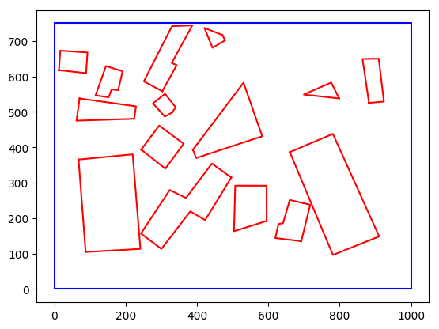

# rooftop_data
This package downloads and creates yaml files (to be used as [PolygonWithHoles](https://github.com/ethz-asl/mav_comm/blob/master/mav_planning_msgs/msg/PolygonWithHoles.msg) ROS messages) from the [EPFL polygon rooftop](https://cvlab.epfl.ch/data/data-polygonalobjectdataset/) dataset.

## Requirements
```
pip install numpy scipy imageio argparse matplotlib pyyaml urllib3
```

## Build dataset
This will download the dataset, and create the yaml files in ./data/Rooftop/yaml
```
python read_rooftop_data.py -p
```
(The `-p` flag will also plot a random image from the dataset). Additional help on other arguments can be found with `python read_rooftop_data.py --help`

## Randomised data
The `generate_synthetic_data.py` script uses the collection of rooftops from the original dataset to build new scenes by randomly placing a number of roof samples in a scene. Command line arguments can be used to specify target directories, the number of roof obstacles, the number of samples etc. Message yaml files will also be created for each scene. A simple example:
```
python generate_synthetic_data.py --plot --n_samples 1 --n_obstacles 15 --no_overlaps
```
Should generate a scene similar to this:


Help with parameters can be seen with `python generate_synthetic_data.py --help`

